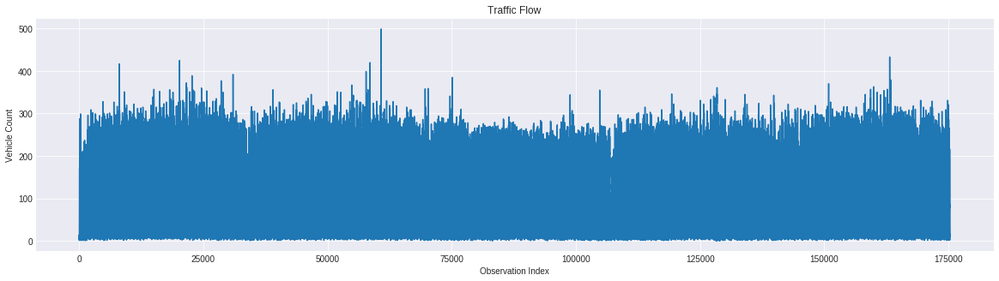
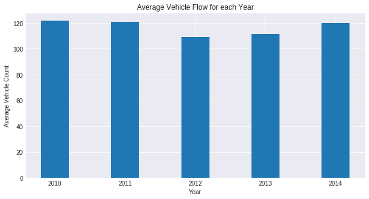
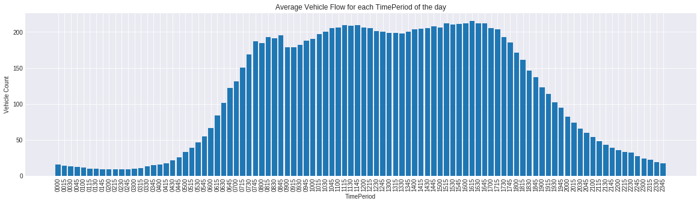
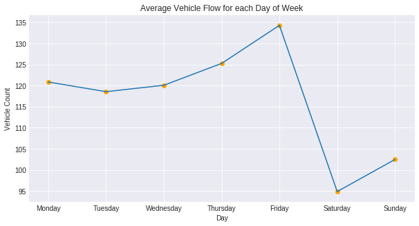
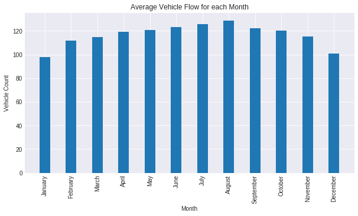
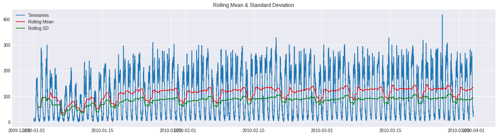
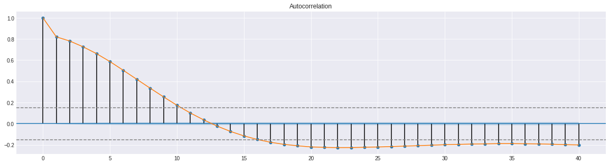

# Traffic Congestion: Exploratory Data Analysis
The objective of this project is to study the effectiveness of various machine learning models for the analysis and forecasting of a road traffic data timeseries. Subsequently, the most suitable model for the use-case has been determined and a prototype application called Traffic Congestion Management System is developed using R and Shiny Dashboard. The web application can predict the traffic conditions for a particular road intersection by training with the traffic data in a timeseries format.

This repository is the exploratory data analysis for the road traffic dataset used in the Traffic Congestion project. The EDA is performed using Python and its libraries - statsmodel, matplotlib, pandas and numpy. Check the Jupyter Notebook <a href='Traffic Congestion - Data Exploration.ipynb'>here</a>.

## Table of Content
- [Introduction](#introduction)
- [Hypothesis Testing](#hypothesis-testing)
- [Stationarity of Timeseries](#stationarity-of-timeseries)
- [Decomposition of Timeseries](#decomposition-of-timeseries)
- [ACF and PACF Analysis](#acf-and-pacf-analysis)
- [Conclusion](#conclusion)

## Introduction
### Timeseries Description
- The  timeseries used for this road traffic data analysis is obtained from data.gov.uk.
- The data is taken from the year 2010 to 2014 (1826 days) at a duration of 15 minutes. 
- For every 24 hours we have 96 observations. Hence, a total of `1826*96 = 175296` observations are recorded. 
- Following is a simple line plot of all the 175296 observations.

### Proposed Machine Learning Model for the problem
For the given use case, the Autoregressive-Integrated-Moving-Average Model (ARIMA) is considered for forecasting. The results of AR, MA, ARMA and ARIMA models will be analyzed. However, before moving forward to the forecasting stage, we will study the pre-conditions of these models.
- Hypothesis for the trend and seasonality in the timeseries will be tested
- Stationarity of the timeseries will be tested using Dicky-Fuller Test
- Decomposition of timeseries will be performed to obtain the residual timeseries 
- ACF and PACF analysis will be performed

## Hypothesis Testing
### 1. Traffic Flow Trend
**Claim:** With increase in time, the population of the area will probably increase. Hence, an upward trend can be expected in the traffic flow as the time goes by.

**Conclusion** 

- No trend exists. Alternative hypothesis holds true.

### 2. Daily Seasonality
**Claim:** The road traffic flow will dependent on the different hours of the day (rush hours vs off hours). Hence, daily seasonality can be expected.

**Conclusion**

- It can be concluded that there is a daily seasonality in the data as similar patterns can be observed in traffic frequency for particular time intervals.
- The rush hours for weekdays are around 11:45 in the morning and 16:15 in the evening.
- Null Hypothesis holds true.

### 3. Weekly Seasonality
**Claim:** The road traffic flow on weekdays will be greater than weekends. Hence weekly seasonality can be expected.

**Conclusion**

- It can be concluded that there is a weekly seasonality in the data as similar patterns can be observed in traffic frequency for each week at a monthly scale.
- The weekdays have more traffic with the highest reaching on Friday. The weekends have lesser traffic.
- Null Hypothesis holds true.

### 4. Annual Seasonality
**Claim:** The road traffic flow will dependent on the different months of the year, due to change in weather conditions. Hence annual seasonality can be expected.

**Conclusion**

- It can be concluded that there is a annual seasonality in the data as similar patterns can be observed in traffic frequency for each month at an yearly scale.
- The average traffic flow rises till August and then decreases till December-January.
- Null Hypothesis holds true.

## Stationarity of Timeseries
The stationarity of the given timeseries is determined using the Augmented Dickey-Fuller stationarity test. Following is the premise of the test.

> **Null-Hypothesis** of the Dickey-Fuller test states that the timeseries is non-stationary (presence of unit root).

> **Alternate Hypothesis** of Dickey-Fuller test states that the times series is stationary (absence of unit root).

### Results of Augmented Dickey-Fuller Test:
The given graph represents the data of a 3 months subset. This will ease the visual interpretation of the plots.

|Statistic|Value|
|:---:|:---:|
|Test Statistic|-26.380273|
|p-value|0.000000|
|# Lags Used|37.000000|
|Number of Observations Used|8602.000000|
|Critical Value / Significance Level (1%)|-3.431110|
|Critical Value / Significance Level (5%)|-2.861876|
|Critical Value / Significance Level (10%)|-2.566949|

**Conclusion**

- The p-value of 0 which is less than our 1% significance level value. This indicates that the null-hypothesis is invalid, with a certainity of 99%. Hence, timeseries is stationary.
- The Test Statistic is much lower than Critical Values. Hence, the null-hypothesis can be rejected and the timeseries is indeed stationary.
- There is no need for applying any de-trending transformation or differencing the timeseries as it is stationary.

## Decomposition of Timeseries

## ACF and PACF Analysis
We will use the most suitable model out of AR, MA, ARMA and ARIMA models for forecasting in the modeling stage. So, in this section we will determine the various parameters that are required for the ARIMA model.

- 'p' or the number of Auto-Regressive terms: These are the lags of forecasted variable
- 'q' or the number of Moving-Average terms: These are the lagging forecasted error
- 'd' or number of differences: This is the number of non seasonal differences

A chart describing the right approach for selecting the AR or MA processes:

||ACF|PACF|
|:-:|:-:|:-:|
|AR|Tails off gradually|Significant till 'n' lags|
|MA|Significant till 'n' lags|Tails off gradually|
|ARMA|Tails off gradually|Tails off gradually|

## Conclusion
- The most suitable model for the timeseries of given use-case appears to be AR or autoregressive model.
- However, for modeling with ARIMA, following parameters can be used.
  - From the given PACF plot, we can determine that the value of 'p' is 2.
  - From the given ACF plot, we can determine that the value of 'q' is 10.
